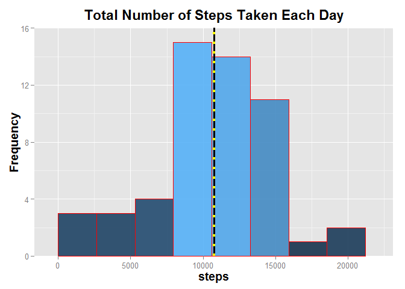
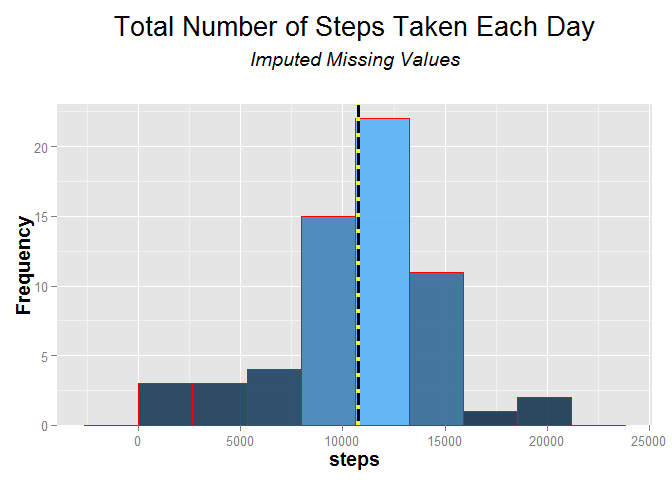
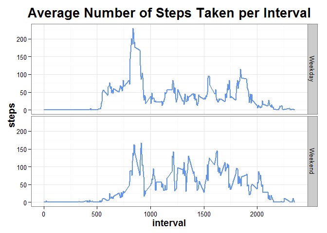

# Reproducible Research: Peer Assessment 1
##Introduction
  
This is the first Project Assignment from the Reproducible Research course.
We are going to analyze data collected from monitoring devices. The dataset 
contains two months of daily activity from an annonymous individual.

##Loading and preprocessing the data  
  
First of all, we gonna load packages and get the data:

**Loading Packages**
  

```r
pack <- c("ggplot2", "dplyr")
usePackage <- function(p) {
      if (!is.element(p, installed.packages()[,1]))
            install.packages(p, dep = TRUE)
      require(p, character.only = TRUE)
}
sapply(pack, usePackage)
```

```
## ggplot2   dplyr 
##    TRUE    TRUE
```
**Loading Activity Dataset**


```r
fileurl <- "https://d396qusza40orc.cloudfront.net/repdata%2Fdata%2Factivity.zip"
download.file(fileurl, destfile = ".\\Data_activity.zip")
file <- unzip(".\\Data_activity.zip")
df <- read.csv(file)
```

##What is the mean total number of steps taken per day?  
In order to calculate the mean total number of steps taken per day, we are
going to use the pipeline approach from the `dplyr` package as follows:  


```r
totalsteps <- df %>% group_by(date) %>% summarise_each(funs(sum), steps)
#Calculate the mean and median
options(scipen=999)
mean_totalsteps <- round(mean(totalsteps$steps, na.rm = TRUE))
median_totalsteps <- median(totalsteps$steps, na.rm = TRUE)
```
The mean and median of the total steps taken per day are:
  
- **Media**: 10766  
- **Median**: 10765
  
A visualization of the total steps per day can be seen in the next histogram:

```r
h <- ggplot(totalsteps, aes(steps)) 
h + geom_histogram(binwidth = 2650, 
                   aes(fill = ..count..),
                   col = "red", 
                   alpha = .9) +
        geom_vline(xintercept = mean_totalsteps, color = "black", size = 1.2, 
                   show_guide=TRUE) +
        geom_vline(xintercept = median_totalsteps, color = "yellow", 
                   linetype = "dotted", size = 1.5, show_guide=TRUE) +
        xlim(c(-500, 22000)) +
        coord_cartesian(ylim = c(0, 16)) +
        labs(title = "Total Number of Steps Taken Each Day", y = "Frequency") +
        theme(axis.title = element_text(face = "bold", size = 14), 
              plot.title = element_text(face = "bold", size = 17, vjust = 1.5), 
              legend.position = "none")
```

 
  
##What is the average daily activity pattern?  
In order to calculate the average daily activity pattern we are gonna use the 
pipeline from the `dplyr` package:

```r
avgsteps <- df %>% group_by(interval) %>% 
            summarise_each(funs(round(mean(., na.rm = TRUE), digits = 2)), 
                           steps)
maxst <- as.data.frame(avgsteps[which.max(avgsteps$steps),])
```
  
Now we proceed to create the time series:


```r
t <- ggplot(avgsteps, aes(interval, steps))
t + geom_line(size = 1, color = "cornflowerblue") + 
      labs(title = "Average Number of Steps Taken per Interval") +
      theme_bw() +
      theme(axis.title = element_text(face = "bold", size = 14), 
      plot.title = element_text(face = "bold", size = 20, vjust = 1.5)) +
      annotate("text", x = 1200, y = 210, label = "Interval: 835", 
               color = "red", size = 6)
```

 
  
From the above Figure, we can see that the 5-minute interval with the most activity
was interval 835.

##Imputing missing values

The variable steps has multiple missing observations 
(2304). Let's see what happen if we imput those
values. We are going to imput the NA values by replacing with the mean of steps
from the specific 5-minute interval and create a new dataset:


```r
data <- as.data.frame(df)
#Using the means calculated and stored in the dataframe avgsteps:
data <- within(data, steps <- ifelse(is.na(steps), 
                                     round(avgsteps$steps), steps))
#What is the mean total number of steps taken per day?
tsteps <- data %>% group_by(date) %>% summarise_each(funs(sum), steps)
#Calculating the new mean and median
mean_tsteps <- round(mean(tsteps$steps, na.rm = TRUE))
median_tsteps <- median(tsteps$steps, na.rm = TRUE)
```
  
The new mean and median of the total steps taken per day are:
  
- **Media**: 10766  
- **Median**: 10762  

And the respective graph:


```r
h2 <- ggplot(tsteps, aes(steps)) 
h2 + geom_histogram(binwidth = 2650, 
                   aes(fill = ..count..),
                   col = "red", 
                   alpha = .9) +
      geom_vline(xintercept = mean_tsteps, color = "black", size = 1.2) +
      geom_vline(xintercept = median_tsteps, color = "yellow", 
                 linetype = "dotted", size = 1.5) +
      coord_cartesian(ylim = c(0, 23)) +
      labs(y = "Frequency") +
      ggtitle(expression(atop("Total Number of Steps Taken Each Day", 
                              atop(italic("Imputed Missing Values"), "")))) +
      theme(axis.title = element_text(face = "bold", size = 14), 
            plot.title = element_text(face = "bold", size = 20, vjust = 1.5), 
            legend.position = "none")
```

 
  
We can see that although the mean and median basically stayed the same (only
the median changed from 10765 to 10762), the 
distribution of the data seems to be affected by the imputation process. 
  
##Are there differences in activity patterns between weekdays and weekends?

Let's explore the activity patterns between weekdays and weekends to see whether
the individual was more active in the weekends or in the weekdays:


```r
#Convert date variable into Date format
data$date <- as.Date(data$date)
#Create variable of day of the week
data$day <- weekdays(data$date, abbreviate = TRUE)
#Create factor variable
data <- within(data, fday <- ifelse(day %in% c("Sat", "Sun"), 1, 0))
data$fday <- as.factor(data$fday)
levels(data$fday) <- c("Weekday", "Weekend")

#Create the average number of steps by intervals and days
weeksteps <- data %>% group_by(interval, fday) %>% 
        summarise_each(funs(round(mean(., na.rm = TRUE))), steps)
```

Now let's create the panel time serie plot: 


```r
p <- ggplot(weeksteps, aes(interval, steps))
p + geom_line(size = 1, color = "cornflowerblue") + 
        facet_grid(fday ~ .) +
        labs(title = "Average Number of Steps Taken per Interval") +
        theme_bw() +
        theme(axis.title = element_text(face = "bold", size = 14), 
              plot.title = element_text(face = "bold", size = 20, 
                                        vjust = 1.5))
```

 

By looking at the panel plot we can say that it seems that the most active days
were the weekends ones. Further investigation is needed in order to have a 
better insight of the daily activity of this unknown individual. 
  
  
  
